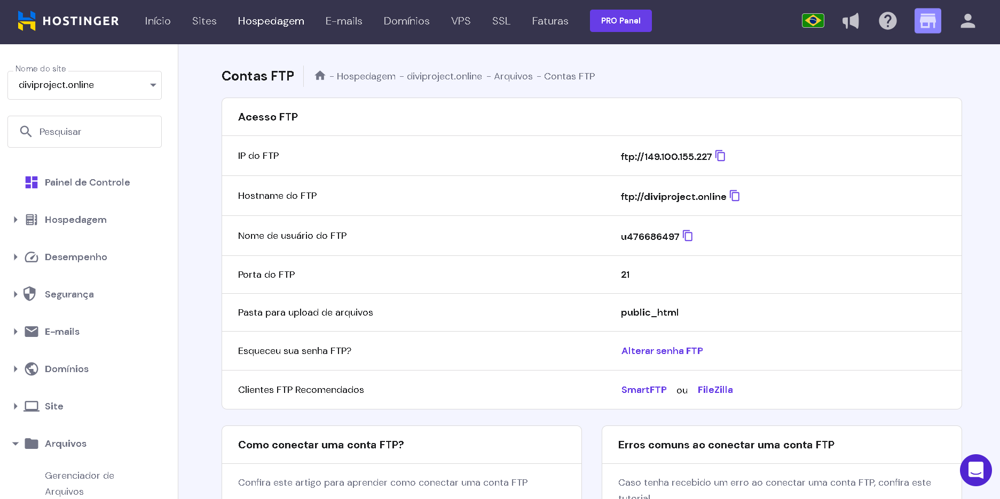

# Hospedagem de uma plaicação WEB
Projeto integrador Senac @05/2023.

## Entendendo o que é uma hospedagem.
Para hospedarmos um site precisamos alocar os arquivos que compôem a nossa aplicação web em um 
servidor que nos fornecerá o serviço de hospedagem. Existem diversos sites que fornecem este serviço, entre os mais consolidados do mercado estão GoDaddy Hostinger Locaweb...

## Passo 1: Acesse o site da Hostinger
Abra o seu navegador e vá para o site da Hostinger em https://www.hostinger.com.br/. Em seguida, clique em "Hospedagem" no menu principal.

## Passo 2: Escolha um plano de hospedagem
A Hostinger oferece vários planos de hospedagem. Escolha aquele que melhor atende às suas necessidades e clique em "Ver planos" ou "Comprar agora". 

## Passo 3: Registre um novo domínio (opcional)
Se você não possui um domínio registrado, pode adquirir um novo através da Hostinger. Digite o nome do domínio desejado e verifique sua disponibilidade. Se estiver disponível, clique em "Adicionar ao carrinho" e siga as instruções para concluir o registro. Ao assinar um plano de hospedagem a hostinger oferece de forma gratuita um domínio. Aqui o nosso domínio é o diviproject.online que está no topo da página de hospedagem.

## Passo 4: Dentro do painel de controle
Aqui no painel de controle vamos nos deparar com uma pasta raiz onde devem estar os arquivos que compoem a nossa aplicação web, se chama public_html.

## Passo 5: Dentro da pasta de arquivos
Dentro da pasta public_html veremos que devemos fazer o upload dos arquivos que dão forma a nossa aplicação web, pegamos então tudo o que compreende o nosso site e colocamos dentro da pasta.

## Passo 6: Está funcionando
Após fazermos corretamente o upload dos arquivos na pasta public_html receberemos a mensagem de que o nosso site está funcionando normalmente. Caso ocorra alguma falha no processo o servidor de hospedagem nos dará uma mensagem de erro e devemos corrigir o que for necessário para que funcione corretamente.

## Passo 7: Upando arquivos por FTP
Para realizarmos o upload de arquivos através do método de FTP precisamos encontrar dentro do servidor de hospedagem a pasta de Arquivos, após entrarmos nela e rolarmos para baixo encontraremos o gerenciador de FTP. Dentro dele precisamos identificar as informações da conta FTP como:Hostname do FTP, Nome de usuário de FTP, Porta do FTP e a Senha.

## Passo 8: Entrando num servidor FTP
Nesta etapa vamos precisar fazer o download de uma aplicação que gerêncie os dados em FTP, neste exemplo estou usando o FireZilla Client.Na parte superior será onde devemos inserir as informações adquiridas no 7° passo. Antes de entrarmos no servidor FTP veremos os arquivos do nosso servidor local (neste caso o meu Pc) a esquerda do monitor.

## Passo 9:

## Passo 10:

